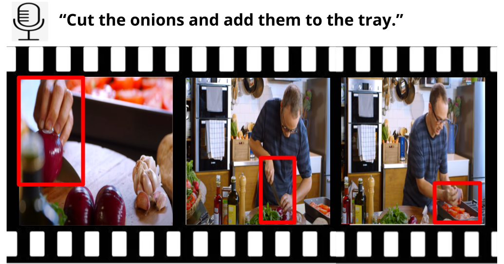

# Look at What I’m Doing: Self-Supervised Spatial Grounding of Narrations in Instructional Videos

This repository contains a PyTorch implementation of the paper [Look at What I’m Doing: Self-Supervised Spatial Grounding of Narrations in Instructional Videos](https://proceedings.neurips.cc/paper/2021/file/792dd774336314c3c27a04bb260cf2cf-Paper.pdf) accepted at NeurIPS 2021 (spotlight). If you find this implementation or the paper helpful, please consider citing:

    @InProceedings{tanCOMMA2021,
         author={Reuben Tan and Bryan A. Plummer and Kate Saenko and Hailin Jin and Bryan Russell},
         title={Look at What I’m Doing: Self-Supervised Spatial Grounding of Narrations in Instructional Videos},
         booktitle={Advances in Neural Information Processing Systems (NeurIPS)},
         year={2021} }

# Dependencies

1. Python 3.6
2. Pytorch version 1.7.0

# Project Code Files
The code is currently getting cleaned up and tested. It will be released very soon! Thank you for your patience.

